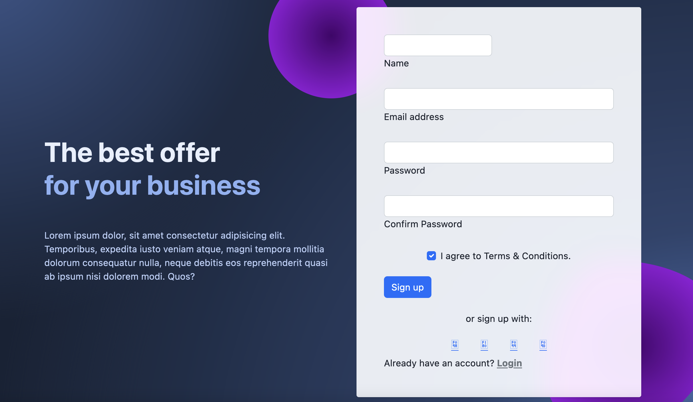

# `Travel Map`

See all of your bookmarks on Google Maps.

## What is it?

Travel Map uses the Google Maps API to plot bookmark pins so that you can easily see your saved destinations.

Travel Map allows users to:

- Create an account.
- Search for destinations/locations via Google Maps.
- Create, edit, and delete bookmarks.
- Display the saved bookmarks for a given area.
- Access their user profile for the app.

## Installation Instructions

1. Fork and clone this repository.
2. Run `npm install` from your terminal while inside of the project's directory.
3. Set up a `.env` file and add `SECRET_SESSION=YOUR_KEY_HERE` and `API_KEY=YOUR_GOOGLE_MAPS_API_KEY_HERE`
4. Run `sequelize db:create` from your terminal or manually create the required database in your server.
5. Run `sequelize db:migrate` from your terminal to update your database's schema to the project's specifications.
6. Run your server and access the app through the port specified in `server.js`.

## Navigating The Project

### User Routes

| Method | Path         | Location  | Purpose              |
| ------ | ------------ | --------- | -------------------- |
| GET    | /            | server.js | Home page            |
| GET    | /auth/login  | auth.js   | Login form           |
| GET    | /auth/signup | auth.js   | Signup form          |
| POST   | /auth/login  | auth.js   | Login user           |
| POST   | /auth/signup | auth.js   | Creates User         |
| GET    | /auth/logout | auth.js   | Removes session info |
| GET    | /profile     | server.js | Regular User Profile |

### Map Routes

| Method | Path        | Location | Purpose               |
| ------ | ----------- | -------- | --------------------- |
| GET    | /map        | map.js   | Home page             |
| GET    | /map/search | map.js   | Search Results screen |
| POST   | /map/new    | map.js   | Create bookmark       |
| PUT    | /map/edit   | map.js   | Edit bookmark         |
| DELETE | /map/delete | map.js   | Deletes bookmark      |

#### Entity Relationship Diagram

#### User Model

- **Description:** This model is used to store user information.
- **Attributes:**
  - **id:** Automatically generated by the ORM.
  - **name:** The user's actual name ie., Johnny Appleseed
  - **email:** User's email.
  - **password:** User's password
  - **createdAt:** Automatically generated by the ORM.
  - **updatedAt:** Automatically generated by the ORM.

#### Bookmark Model

- **Description:** This model is used to store user created bookmarks.
- **Attributes:**
  - **id:** Automatically generated by the ORM.
  - **userId:** id corresponding to an id in the user's table. This tracks which user created the bookmark.
  - **lat:** Latitude obtained from location search.
  - **lng:** Longtitude obtained from location search.
  - **name:** User inputted nickname for bookmark (optional).
  - **address:** User inputted address.
  - **createdAt:** Automatically generated by the ORM.
  - **updatedAt:** Automatically generated by the ORM.

### Using the App

#### Login

Users are automatically redirected here if they are not logged in.

#### Signup

Users can create an account here if they do not have one or wish create another one. Once the user submits the signup form, the following validations occur:

- App checks to see if there are other users using the same email before creating the account.
- Inputted password is verified so that it is valid. It also verifies that the same password is inputted twice.
- Password is encrypted before it's stored in the database.

#### Profile

This page displays each user's information. Edit feature coming soon.

#### Map

Users will find their saved bookmarks plotted on a map to easily see which locations are near each other.

#### Search

Based on the user input, the Google Maps API will return the specific address typed or search results based on the user's location.

#### Create Bookmark

Users will input the address for their newly created bookmark. They may choose to create a nickname for the bookmark as well.

Coming soon: Descriptions
