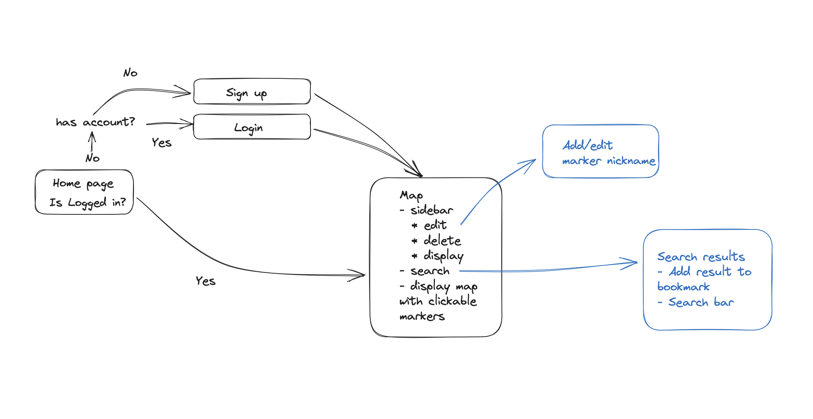

# Project 2 Planning

## Part 1

Review the Project 2 requirements and check out some [examples](https://romebell.gitbook.io/sei-802/projects/past-projects/project2).

In this space below, list **THREE** ideas for your Project 2. For each idea, include [user stories](https://www.atlassian.com/agile/project-management/user-stories) for each idea and a link to the API(s) you want to use for it.

---

1. As someone who travels frequently, I want to see all my bookmarks easily for a given area. [Google Maps API](https://developers.google.com/maps)
2. As someone who enjoys trying new restaurants, I want a fun way to find new restaurants through a randomizer. [Yelp API](https://docs.developer.yelp.com/docs/fusion-intro)
3. As a frequent flyer, I want an easy way to track flights. [Flight API](https://spire.com/aviation)

---

Make a PR when you're done!

---

## Part 2

In the space below:

- either embed or link a completed ERD for your approved P2 idea
- if there are any changes/additions to your user stories, place your full set of revised user stories here
- either embed or link wireframes for every page of your app

---

### ERD


### User Stories

- As a user, I want to be able to log in, but only if the email and password are correct.
- As a user, I want to be able to create an account if I don't have one.
- As a user, I want to be redirected to the login page if I am not logged in.
- As a user, I want to be able to log out so that the next person using the browser cannot access my account.
- As a user, I want to be able to see all of saved bookmarks on a zoomable map.
- As a user, I want to be able to click on the bookmark pins to view information about it.
- As a user, I want to be able to edit or delete my saved bookmarks.
- As a user, I want to be able to search places to create new bookmarks.
- As a user, I don't want someone without my login credentials to add, edit, or delete my bookmarks.

---

### Wireframes



---

Make a PR when you're done!

## Requirements Inside `Project Board`

`card` FUNDAMENTALS

```
### FUNDAMENTALS
- [ ] Deployed (e.g. Heroku)
- [X] Site has basic functionality related to its goal
- [X] At least 2 GET routes (other than auth)
- [X] At least 1 POST route
- [X] At least 1 DELETE route
- [X] At least 1 PUT route
```

`card` SUFFICIENT DIFFICULTY

```
### SUFFICIENT DIFFICULTY: At least 1 of the following:
- [X] Use of an API
- [ ] Advanced Database Relationships
- [ ] Sockets
- [ ] Scraping
- [ ] OAuth
- [ ] Other
```

`card` AUTH/SECURITY

```
### AUTH/SECURITY (Mostly From Template Boilerplate)
- [X] Log in works (required: boilerplate or better)
- [X] Sensible error messages for bad login info  (boilerplate or better)
- [X] Passwords hashed in database
- [X] Passwords in form are input type="password" (dots)
- [X] Password verification is checked
- [X] Can't sneak edit/delete data that I don't own by typing in random ids
```

`card` GITHUB USAGE

```
### GITHUB USAGE
- [ ] Appropriate Use of Github
- [ ] `README` is included and is descriptive
- [ ] `.gitignore` properly set up
- [ ] No API keys in Github code (used a .env file)
- [ ] Multiple commits per day
- [X] Repo up on day 1 of project week or sooner
- [ ] `README` has *Installation Instructions*
```

`card` DATABASE USAGE

```
### DATABASE USAGE
- [X] At least 2 Models other than join tables (required)
- [X] Relationships were set up appropriately between models
- [ ] Avoided global variables, storing data in files, etc
- [ ] No raw file/image data stored in database, etc
```

`card` CODE STYLE

```
### CODE STYLE
- [ ] Generally DRY code / No enormous files
- [X] Proper indentation (or mostly pretty good!)
- [X] Naming conventions kept
- [ ] No glaring logic errors
```

`card` USER EXPERIENCE

```
### USER EXPERIENCE
- [X] Effort was put into design
- [ ] No broken links (server errors or 404s)
- [X] Typing a purposely bad link renders an error ejs page
- [ ] Content is responsive to screen size changes
- [ ] No glaring alignment or grid errors
```
